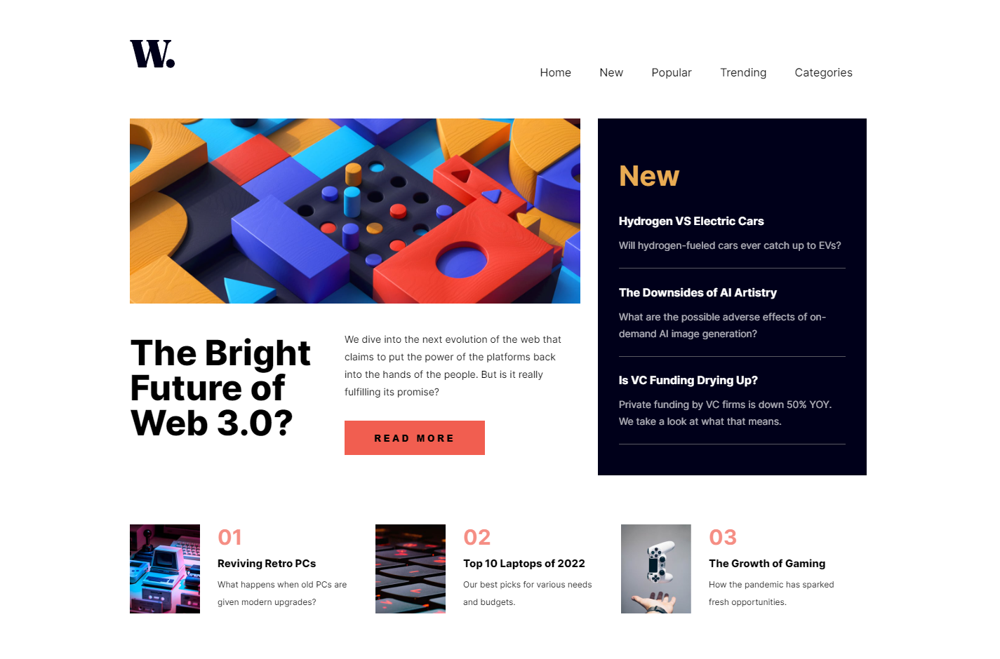
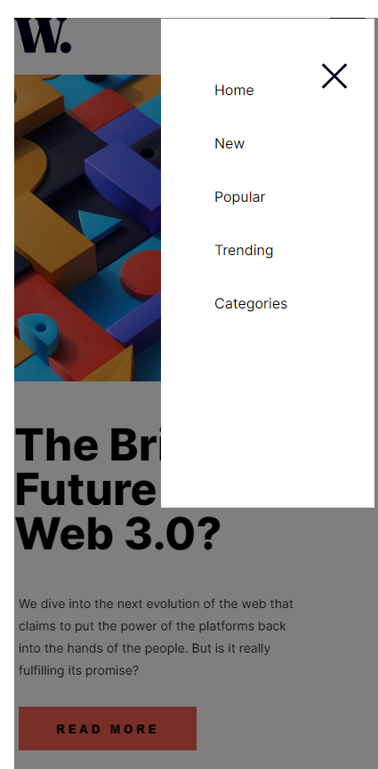

# Frontend Mentor - Intro component with sign up form

# Project Name
- Practice building out a sign-up form complete with client-side validation using JavaScript.
- Live demo [Intro component with sign-up form](https://www.frontendmentor.io/challenges/news-homepage-H6SWTa1MFl). 

## Table of Contents
* [General Info](#general-information)
* [Technologies Used](#technologies-used)
* [Features](#features)
* [Screenshots](#screenshots)
* [Acknowledgements](#acknowledgements)
* [Contact](#contact)

## General Information
- This is my second solution of Frontend Mentor with JavaScript. An excellent exercise in combining HTML, CSS and JavaScript. Not forgetting about responsiveness.

## Technologies Used
- HTML5 Markup
- CSS 
- Flexbox
- Grid
- RWD - Responsive Web Design 
- JavaScript

## Features
List the ready features here:
- HTML, CSS with JS and jQuery

## Screenshots

## Acknowledgements
- This project was based on [Frontend Mentor](https://www.example.com).

## Contact
Created by [@mr_cyclist] - contact me!